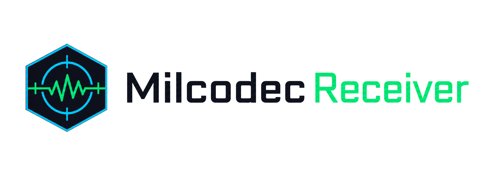

<div align="center">
  <picture><source media="(prefers-color-scheme: dark)" srcset="https://raw.githubusercontent.com/monarchcastletech/milcodec-receiver/main/docs/logo-dark.png"></picture>
  <!-- CODEX: generate a clean product logo — a stylized hexagonal "⬡" signal/receiver glyph with a chirp waveform sweeping across it, in cyan (#00d4ff) and signal-green (#00ff88) on a near-black (#0d0d14) field. Defense-grade, minimal, monogram-friendly. -->

  # Milcodec Receiver
  ### Browser-based acoustic data link for MILCODEC encrypted signals

  
  
  
  
</div>

> **Executive summary** — Milcodec Receiver is a zero-install, browser-native receiver that demodulates and decrypts MILCODEC messages carried over sound. It turns any phone or laptop into an acoustic intercept terminal: a near-ultrasonic chirp-spread-spectrum signal arriving at the device microphone is matched-filtered, error-corrected, authenticated, and surfaced as a prioritized message inbox — all client-side, behind a covert FM-radio interface. Built by the Defense Intelligence division of Monarch Castle Technologies for short-range, infrastructure-independent communications where RF is unavailable, monitored, or undesirable.

## ✨ Highlights
- **Data-over-sound** reception in the **14–17 kHz** near-ultrasonic band — no radios, no pairing, no network. The air gap *is* the channel.
- **Chirp Spread Spectrum ("The Dolphin") modulation** — binary chirp keying (up-chirp = 1, down-chirp = 0) at 20 baud, decoded with a matched-filter correlation receiver for robustness against ambient noise.
- **Authenticated encryption** via TweetNaCl `secretbox` (XSalsa20-Poly1305): every payload is decrypted and integrity-checked before it ever reaches the operator's inbox.
- **Forward error correction** — 3× repetition coding with majority-vote bit recovery, plus a preamble + 16-bit sync word + length-prefixed framing protocol for reliable packet recovery.
- **Military message precedence** — decoded traffic is tagged `FLASH` / `IMMEDIATE` / `ROUTINE`, with audible alerting on high-priority receipt.
- **Covert operating mode** — the live UI presents as an ordinary FM tuner; the receiver console unlocks only on a secret gesture and passcode.
- **Real-time spectral visualizer** — Web Audio FFT spectrum and signal-strength indicator for live link assessment.

## 🖼️ Preview
<!-- CODEX: capture real screenshots from the live build at https://monarchcastletech.github.io/milcodec-receiver/ and drop them into docs/ -->
<!--  (screenshot pending) -->
<!--  (screenshot pending) -->

## 🧭 What it does
Milcodec Receiver is the receive half of an acoustic covert channel. A companion sender plays an encoded waveform through a speaker; this application listens through the microphone, recovers the bitstream, decrypts it, and displays the message.

**End-to-end signal flow:**
```
PC Sender → Speaker → Air (acoustic) → Device Mic → Milcodec Receiver → Decode → Decrypt → Inbox
```

### Demodulation — "The Dolphin" CSS engine (`decoder.js`)
The decoder generates linear up- and down-chirp templates (14 kHz ⇄ 17 kHz over a 50 ms symbol) and slides them across the captured audio as a correlation receiver. It locates the `U-U-D-D` preamble by spaced peak detection, locks to a 16-bit sync word, reads a 16-bit payload-length field, then recovers each payload bit by majority vote across three transmitted copies before reassembling bytes.

### Decryption & authentication (`crypto.js`)
Recovered payloads are NaCl `secretbox` frames (24-byte nonce + ciphertext). On successful open, the inner packet is parsed as `1-byte type + 64-byte signature field + JSON body`, yielding the message text and its precedence. Failed opens are rejected and never displayed.

### Operator console (`index.html`, `app.js`, `style.css`)
The console runs entirely on the Web Audio API — `getUserMedia` capture, an `AnalyserNode` spectrum, and a `ScriptProcessor` that batches ~2–3 seconds of audio per decode pass. In covert mode the interface mimics an FM radio (tuner dial, scan, power, stereo indicator); triple-clicking the stereo indicator opens a passcode gate that reveals the receiver, its inbox, and the live decode log.

## 🗂️ Inputs, outputs & provenance
This is an analytical **tool**, not a data feed — but Monarch Castle doctrine still governs every message it surfaces: *evidence before assertion.*

- **Input:** live acoustic audio from the device microphone (mono, 44.1 kHz), captured only after explicit user permission.
- **Output:** decoded messages, each stamped at the point of receipt with:
  - **collected_at** — local reception timestamp on the receiving device,
  - **priority** — military precedence (`FLASH` / `IMMEDIATE` / `ROUTINE`),
  - **method** — `MILCODEC CSS · 14–17 kHz · secretbox(XSalsa20-Poly1305)`,
  - **verification** — authentication status of the sender / packet.
- **Auditability:** a live debug log records preamble locks, extracted bit counts, payload lengths, and decrypt outcomes so every displayed message is traceable from raw audio to plaintext.

## 🛠️ Tech stack
- **Language:** vanilla **JavaScript** (no framework, no build step) · **HTML5** · **CSS3**
- **DSP / capture:** **Web Audio API** — `AudioContext`, `AnalyserNode`, `ScriptProcessorNode`, `getUserMedia`; HTML5 `<canvas>` spectrum rendering
- **Cryptography:** **TweetNaCl** (`nacl-fast`) + `tweetnacl-util`, loaded via jsDelivr CDN
- **Modulation:** custom Chirp Spread Spectrum codec ("The Dolphin") with repetition-code FEC
- **Hosting:** **GitHub Pages** (static, HTTPS — required for microphone access); `.nojekyll` for raw asset serving
- **Test harnesses:** `test_crypto.html`, `test_file.html` — in-browser round-trip checks for the crypto and end-to-end paths

## 🚀 Getting started

**Use the live build (recommended):**
- Open **https://monarchcastletech.github.io/milcodec-receiver/** on a modern browser (Chrome, Safari, or Firefox) — HTTPS is required for microphone access.

**Operate the receiver:**
1. The interface opens as an FM radio tuner (cover mode).
2. **Triple-click the `STEREO` indicator** to reveal the passcode gate.
3. Enter the demo passcode `DELTA` to unlock the receiver console.
4. Press **POWER**, then grant microphone permission when prompted.
5. Decoded transmissions appear in the **INBOX**, tagged by precedence; high-priority traffic triggers an audible alert.

**Run locally:**
```bash
git clone https://github.com/monarchcastletech/milcodec-receiver.git
cd milcodec-receiver
python -m http.server 8080
# open http://localhost:8080
```

**Deploy your own:** push the repository contents to a GitHub repo, enable **Settings → Pages → Deploy from branch (`main`)**, and the receiver is served over HTTPS in about a minute.

> **Operational note.** This build ships with a **hardcoded demo key and passcode** for evaluation only. For any operational use, replace the symmetric key with a proper key-exchange / key-management scheme and remove the static passcode. The cover interface and default credentials are demonstration defaults, not a security control.

## 🧱 Part of Monarch Castle
> A product of **Defense Intelligence** · **Monarch Castle Technologies** — an operating company of **[Monarch Castle Holdings](https://github.com/MonarchCastleHoldings)**.
> Sister companies: [Monarch Castle Technologies](https://github.com/monarchcastletech) · [Strategic Data Company of Ankara](https://github.com/SDCofA)

## 📜 License
See `LICENSE`. © 2026 Monarch Castle Holdings · Ankara, Türkiye.

<div align="center"><sub>🏰 Monarch Castle Holdings — turning open-source noise into lawful, verified, decision-grade intelligence.</sub></div>